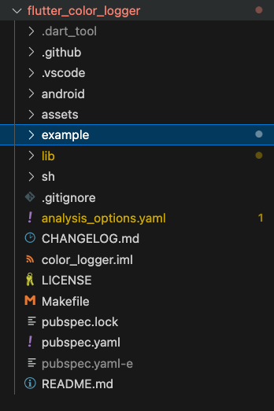
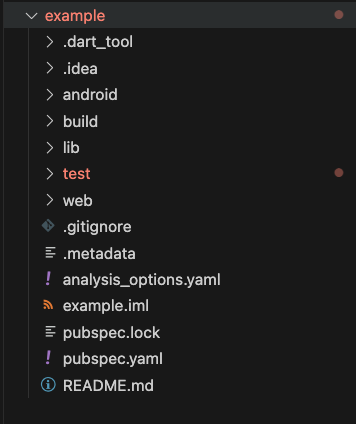

### Feature 
* Support flutter logger navigator to line position in debug console 
    * Convert the package path to absolute path and then you cant tap and fast to debug the code 
* dependency on flutter package
    - more feature => [color_logging](https://pub.dev/packages/color_logging)
    - more feature => [color_observer_logger](https://pub.dev/packages/color_observer_logger)

#### color_logging
* without extension

* with extension you can tap absolute path to code line


#### color_observer_logger
* without extension

* with extension you can tap absolute path to code line


### How to support when debug the TestPackage/example/lib/main.dart

* Do not import all package project
    * 

* Just import example 
    *  

### Multi-level Workspace Support

This extension now supports multi-level workspace structures, handling complex project organizations:

* Use `customPrefix` setting to specify custom path prefixes
* Support for Git package dependencies with automatic relative path handling
* Correctly resolve package paths in different workspace levels

#### Configuration

In VSCode settings, you can configure `FlutterLoggerEasyLife.customPrefix` to specify a custom path prefix:

* Global settings: Applied to all projects
* Workspace settings: Applied only to the current workspace, takes precedence over global settings

This enables correct code navigation in multi-level project structures.

#### Project Structure Example

```
foo
├── .vscode/settings.json
├── flutterProject
└── flutterProject2
```

#### Settings Example

```json
// .vscode/settings.json
{
    "FlutterLoggerEasyLife.customPrefix": "./"
}
```

#### If help you, please give me a star. Thanks you so much